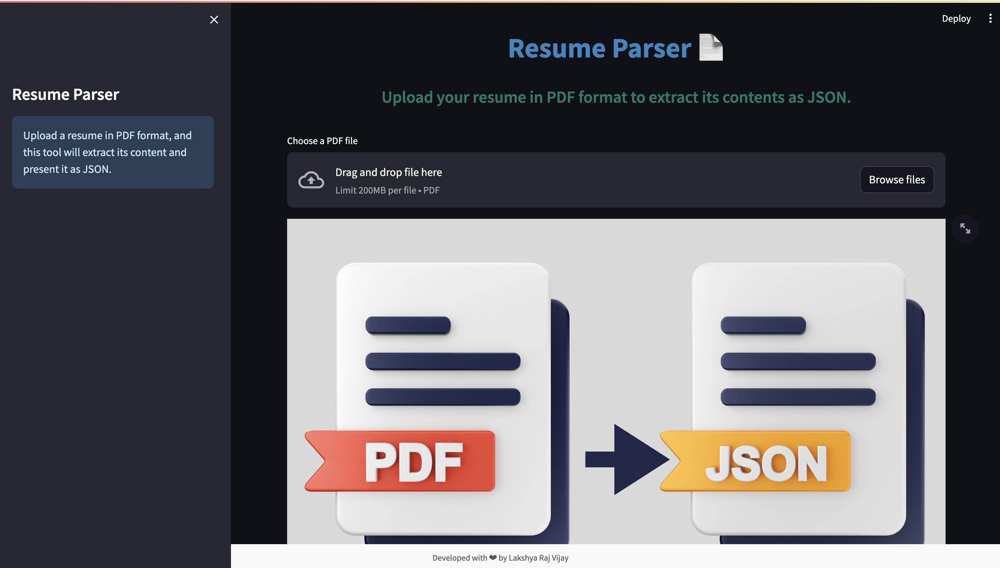

# Resume Parser App - GPT PROMPT

Create a Streamlit application for parsing a resume PDF and displaying its contents as JSON. The application includes the following features:

1. **Upload functionality for a PDF file.**
2. **Display a summary in the sidebar with the following information:**
   - Number of pages in the PDF.
   - Number of words in the PDF.
   - Number of sections/categories found in the resume content (e.g., Experience, Education, Skills).
3. **Display the parsed content under each section heading, with each line of text on a separate line.**
4. **Provide a download button to download the parsed resume content as JSON.**

## Demo



## Getting Started

To run the application locally, follow these steps:

1. Clone the repository:

   ```bash
   git clone https://github.com/your-username/your-repo.git
   cd your-repo 
```bash
   git clone https://github.com/your-username/your-repo.git
   cd your-repo
